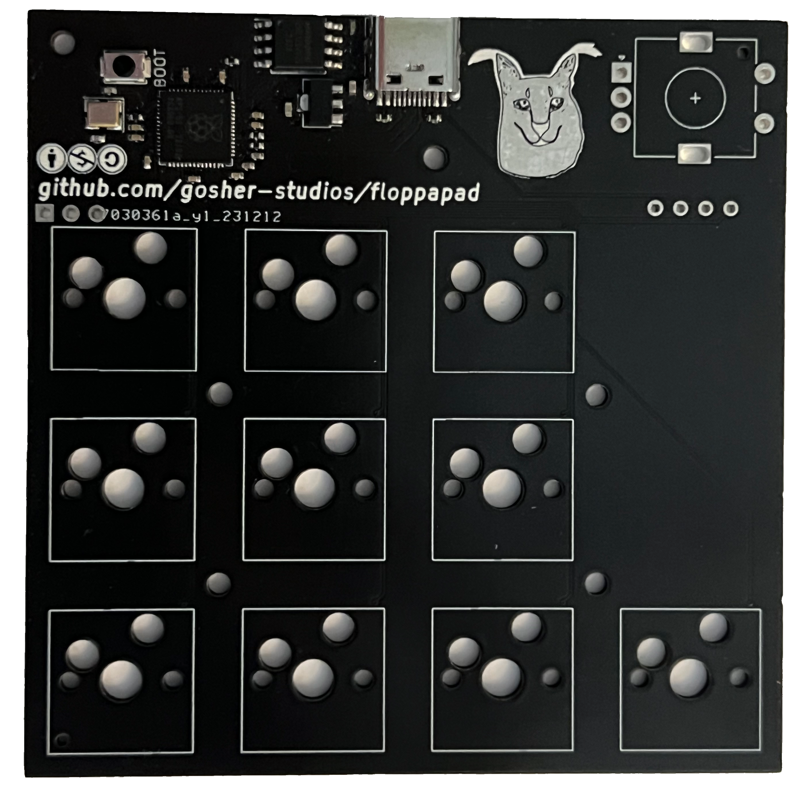

silly little macropad

### features
- 10 hotswappable mx switches
- 128x32px oled display
- rotary encoder
- usb c
- scriptable and extensible firmware (coming soon)
- the silly caracal
   

### Parts list

| Part                             | Quantity | Est. price | Example link |
|----------------------------------|----------|------------|--------------|
| RP2040                           | 1        | $1.01      | [LCSC](https://www.lcsc.com/product-detail/Microcontroller-Units-MCUs-MPUs-SOCs_Raspberry-Pi-RP2040_C2040.html) |
| USB-C port                       | 1        | $0.16      | [LCSC](https://www.lcsc.com/product-detail/USB-Connectors_Korean-Hroparts-Elec-TYPE-C-31-M-12_C165948.html) |
| SSD1306 128x32 OLED board        | 1        | $4.00      | [42. Keebs](https://42keebs.eu/shop/parts/oled-display-0-91-128x32) |
| EC11 Rotary encoder              | 1        | $2.00      | [LCSC](https://www.lcsc.com/product-detail/span-style-background-color-ff0-Rotary-span-Encoders_ALPSALPINE-EC11E183440C_C370986.html) |
| Kailh MX Hotswap socket          | 10       | $3.00      | [Mechboards](https://mechboards.co.uk/collections/components/products/kailh-hotswap-sockets) |
| MX Compatible switch             | 10       | ~$10.00    | bring your favourite ✨ |
| SOIC 208-mil SPI flash           | 1        | $0.56      | [LCSC](https://www.lcsc.com/product-detail/NOR-FLASH_Winbond-Elec-W25Q128JVSIQ_C97521.html) |
| SMD3225 12MHz Crystal oscillator | 1        | $0.06      | [LCSC](https://www.lcsc.com/product-detail/Crystals_YXC-X322512MSB4SI_C9002.html) |
| 3.9x2.9mm SMD Switch             | 1        | $0.11      | [LCSC](https://www.lcsc.com/product-detail/Tactile-Switches_ALPSALPINE-SKRKAEE020_C115357.html) |
| SOT-89 3.3v Voltage regulator    | 1        | $0.05      | [LCSC](https://www.lcsc.com/product-detail/Linear-Voltage-Regulators-LDO_UMW-Youtai-Semiconductor-Co-Ltd-AMS1117-3-3_C347256.html) |
| 27.4Ω Resistor                   | 2        | < $0.00    | [LCSC](https://www.lcsc.com/product-detail/Chip-Resistor-Surface-Mount_UNI-ROYAL-Uniroyal-Elec-0402WGF274JTCE_C31439.html) |
| 1kΩ Resistor                     | 2        | < $0.00    | [LCSC](https://www.lcsc.com/product-detail/Chip-Resistor-Surface-Mount_UNI-ROYAL-Uniroyal-Elec-0402WGF1001TCE_C11702.html) |
| 5.1kΩ Resistor                   | 2        | < $0.00    | [LCSC](https://www.lcsc.com/product-detail/Chip-Resistor-Surface-Mount_UNI-ROYAL-Uniroyal-Elec-0402WGF5101TCE_C25905.html) |
| 27pF Capacitor                   | 2        | < $0.00    | [LCSC](https://www.lcsc.com/product-detail/Multilayer-Ceramic-Capacitors-MLCC-SMD-SMT_Samsung-Electro-Mechanics-CL05C270JB51PNC_C472451.html) |
| 100nF Capacitor                  | 10       | < $0.00    | [LCSC](https://www.lcsc.com/product-detail/Multilayer-Ceramic-Capacitors-MLCC-SMD-SMT_Samsung-Electro-Mechanics-CL05B104KO5NNNC_C1525.html) |
| 1uF Capacitor                    | 2        | < $0.00    | [LCSC](https://www.lcsc.com/product-detail/Multilayer-Ceramic-Capacitors-MLCC-SMD-SMT_Samsung-Electro-Mechanics-CL05A105KA5NQNC_C52923.html) |
| 10uF Capacitor                   | 2        | < $0.00    | [LCSC](https://www.lcsc.com/product-detail/Multilayer-Ceramic-Capacitors-MLCC-SMD-SMT_Samsung-Electro-Mechanics-CL05A106MQ5NUNC_C15525.html) |

---

Brought to you by Alex T and Gosha T ❤️ \
This work is licensed under [Creative Commons BY-NC-SA 4.0](https://creativecommons.org/licenses/by-nc-sa/4.0/) \

